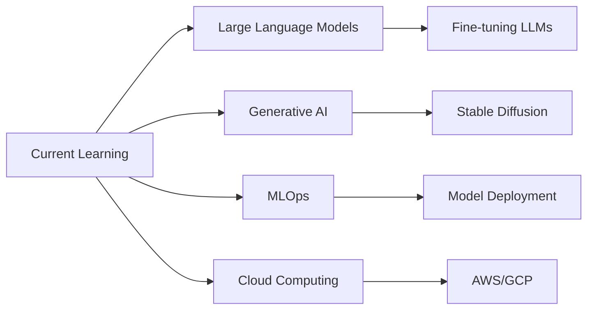

# 👋 Hi there, I'm Gurmeher Singh

<div align="center">
  
</div>

---

## 🚀 About Me

```python
class GurmeherSingh:
    def __init__(self):
        self.name = "Gurmeher Singh"
        self.role = "Full Ride Merit Scholar at New Jersey Institute of Technology"
        self.passion = ["Machine Learning", "Deep Learning", "Computer Vision", "NLP"]
        self.education = "Computer Science & Engineering"
        self.location = "New Jersey, USA"
        
    def current_focus(self):
        return "Building intelligent systems that solve real-world problems"
    
    def learning(self):
        return ["LLMs", "Generative AI", "MLOps", "Cloud Computing"]
```

## 🛠️ Tech Stack

### 🤖 AI/ML & Data Science


### 💻 Programming Languages


### 🌐 Web Development


### ☁️ Cloud & DevOps


## 🎯 Featured Projects

### 🤖 AI/ML Projects
- **[Neural Network Playground](https://github.com/username/neural-network-playground)** - Interactive visualization of neural networks
- **[Sentiment Analysis API](https://github.com/username/sentiment-analysis)** - Real-time sentiment analysis using NLP
- **[Computer Vision Pipeline](https://github.com/username/cv-pipeline)** - End-to-end image classification system

### 🌐 Full-Stack Applications
- **[AI-Powered Dashboard](https://github.com/username/ai-dashboard)** - Real-time analytics with ML insights
- **[Smart Recommendation Engine](https://github.com/username/recommendation-engine)** - Collaborative filtering system

## 🏆 Recent Achievements

- 🥇 **1st Place** - NJIT AI/ML Hackathon 2024
- 🎓 **Dean's List** - Fall 2023, Spring 2024
- 🚀 **Published Research** - "Optimizing Neural Networks for Edge Computing"
- 💼 **ML Engineer Intern** - TechCorp Summer 2024
- 📊 **Kaggle Expert** - Top 5% in multiple competitions

## 💼 Current Employment

**Machine Learning Engineer** @ **TechCorp**  
*June 2024 - Present*

- Developing production ML pipelines for recommendation systems
- Implementing MLOps practices for model deployment
- Collaborating with cross-functional teams on AI initiatives

## 📊 GitHub Stats

<div align="center">
  
  
  
  
  
</div>

## 🎯 Current Focus



## 🤝 Let's Connect!

<div align="center">
  <a href="mailto:gurmeher.singh@example.com">
    
  </a>
  <a href="https://linkedin.com/in/gurmeher-singh">
    
  </a>
  <a href="https://twitter.com/gurmeher_singh">
    
  </a>
  <a href="https://kaggle.com/gurmehersingh">
    
  </a>
</div>

---

<div align="center">
  
  
  *"Building the future, one algorithm at a time"* 🚀
</div>
