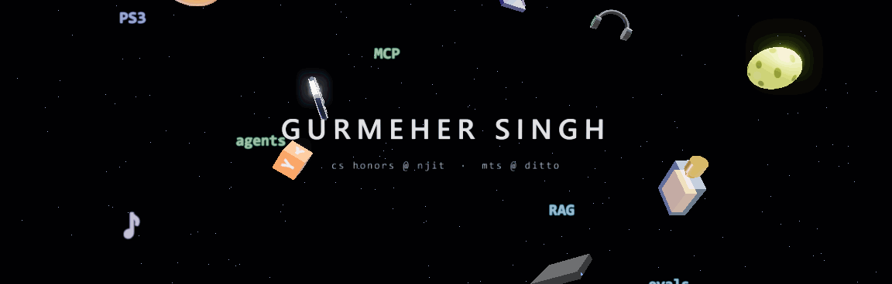

  

 

I build AI-native products end to end — ML pipelines, LLM agents, and the full-stack apps that ship them.

**now** · Member of Technical Staff Intern @ [Ditto](https://ditto.ai) ($9.2M seed) · CS & AI @ NJIT '28 · 3.84 · full-ride merit scholar

**next** · seeking **fall '26 internships** → [guru170606@gmail.com](mailto:guru170606@gmail.com)

## at ditto

- **Event-signup platform** — end-to-end system behind **15,000+ signups across 10+ live events**: race-safe idempotent signup APIs, lifecycle-gated publishing, and a self-serve dashboard that lets the marketing team launch events with zero engineering involvement
- **LLM agent skills** — event-aware chatbot on Ditto's iMessage platform: token-boundary signup-code detection, database-rendered prompts that update with zero redeploys, LangSmith-traced tool calls
- **Growth engineering** — campaign referral dashboards (6-stage funnel, UTM attribution, PostHog), school "temperature" scoring for launch targeting, programmatic SEO

## before ditto

- **ML Engineer** @ Grace Hopper AI Research Institute, NJIT — Optuna-tuned BERTopic pipeline (UMAP + HDBSCAN) on **800K course evaluations**, topic coherence 0.51 → 0.80
- **ML Research Intern** @ Arya Lab, NJIT — PyTorch deep-RL (actor-critic) for leader selection in social networks
- **SWE Intern** @ Welzin — hybrid RAG chatbot (Qdrant, MMR retrieval, cross-encoder reranking, +50% answer relevance) and a multi-agent credit-card recommender (Neo4j + LangGraph)

## projects

| | |
|---|---|
| **[NJIT Elective Advisor](https://github.com/GurmeherSingh/NJITElectiveAdvisor)** | Course recommendations for 1,176 NJIT courses (TF-IDF + NLTK multi-factor scoring) — **2,000 users, 20K+ lifetime visits**, live at [njitelectiveadvisor.com](https://njitelectiveadvisor.com). This project got me recruited into Grace Hopper AI by an NJIT director |
| **[Benchwarmer.AI](https://github.com/GurmeherSingh/Benchwarmer.AI)** | **Stanford TreeHacks 2026** — multi-agent pipeline (Nemotron-30B + Claude Opus) that turns research papers into runnable, benchmarked code; parallel sandboxed execution on Modal, live-streamed through a Next.js chatbot |
| **[PayPark](https://github.com/GurmeherSingh/PayPark)** | **4× winner @ Columbia DivHacks** — per-second parking micropayments on XRP Ledger + GPT-5 dynamic-pricing engine. Best Overall (3rd), Best Financial (Capital One), On-chain Innovation (Ripple), Most Popular |
| **[DataCool](https://github.com/GurmeherSingh/DataCool)** | **Best Overall @ NJIT Claude Hackathon** — ML thermal optimizer: 94% hotspot prediction (Histogram Gradient Boosting + SHAP), physics-based simulation achieving 8°C reduction |
| **[CarbonLens](https://github.com/GurmeherSingh/CarbonLens)** | **MLH winner @ GirlHacks 2025** — barcode scanner (ZXing + Gemini) for food carbon-footprint analysis. Best Use of MongoDB Atlas |

## research

- *Leveraging NLP to Transform Course Evaluation* presented at **NEAIR 52nd Conference** alongside Dr. Yi Meng (Associate Director, NJIT)

## more about me

- featured by [NJIT News](https://news.njit.edu/computer-science-student-represents-njit-second-year-treehacks-2026) as the **sole NJIT student at Stanford TreeHacks** — one of 1,000 accepted from 15,000 applicants
- always down to talk about anything, hmu!

## stack

`Python` `TypeScript` `Next.js` `React` `Node` `Flask` `FastAPI` `PyTorch` `LangChain` `LangGraph` `Neo4j` `Qdrant` `MongoDB` `AWS` `Docker`

## find me

[email](mailto:guru170606@gmail.com) · [linkedin](https://www.linkedin.com/in/gurmehersingh) · [devpost](https://devpost.com/GurmeherSingh)

## fun facts

- originally from Saharanpur, UP, India
- watch guy — daily driver is a Tissot PRX carbon · fragrance collector
- solo travel, concerts, podcasts, pickleball, and climbing (sometimes?!)
- bike everywhere — among the top Bay Wheels riders in SF
- console gamer, raised on PS2/PS3
- the banner up top is a real three.js scene rendered frame-by-frame into a GIF — everything falling in it is real
